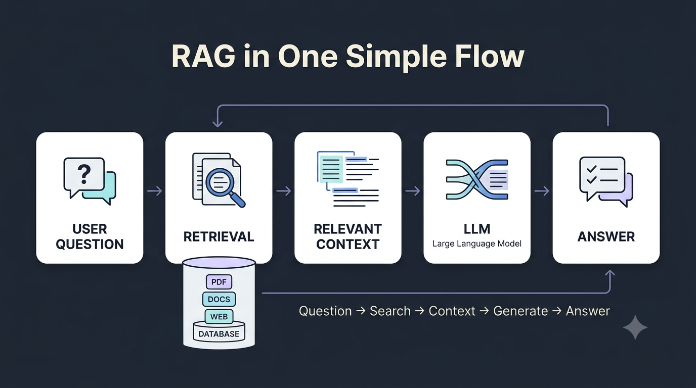
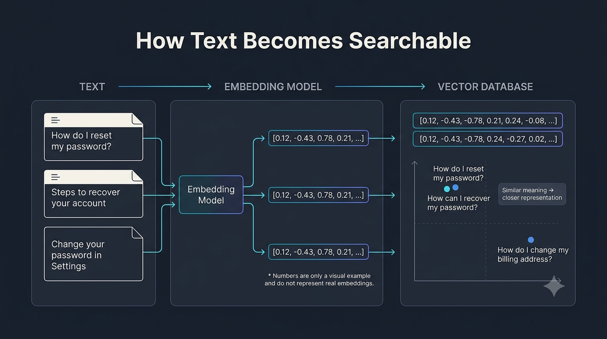
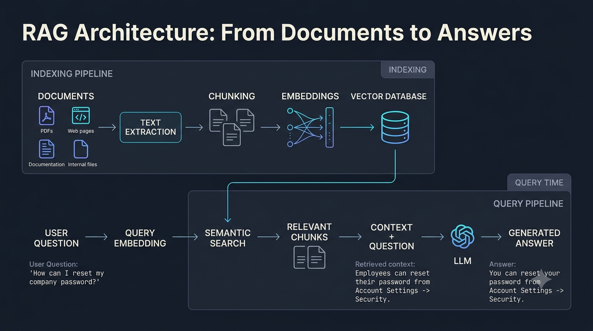

RAG Explained: How AI Applications Use External Knowledge
A practical guide to Retrieval-Augmented Generation, embeddings, vector search, and grounded AI

Large Language Models can write, summarize, explain, and answer questions remarkably well.

But there is a catch.

What happens when the information we need isn't available in the model's accessible knowledge?

Imagine an employee asking an AI assistant:

"What is our company's refund policy for enterprise customers?"

The model may understand exactly what a refund policy is, but that doesn't mean it knows the company's actual policy.

A better approach is to let the application find the relevant information first and then give that information to the language model.

That's the basic idea behind Retrieval-Augmented Generation, or RAG.

What Is RAG?

RAG stands for Retrieval-Augmented Generation.

Despite the intimidating name, the idea is fairly simple.

A RAG system combines two main capabilities:

Retrieval: Find information relevant to the user's question.
Generation: Give that information to an LLM and generate a useful response.

At a high level:

User Question
      ↓
Find Relevant Information
      ↓
Give Information to the LLM
      ↓
Generate Answer

The original RAG architecture combined a pretrained language model with an external, retrievable knowledge source. This allowed the model to use information beyond what was stored directly in its parameters.

RAG in one simple flow

The important idea is that the model doesn't have to rely entirely on what it already knows.

Instead, the application can provide useful information at the time the question is asked.

Why Do We Need RAG?

Let's say you're building an AI assistant for a company.

The company has thousands of documents:

Product manuals
Internal policies
Customer support articles
Technical documentation
FAQs
Research documents

Now imagine a customer asks:

"Can I get a refund after 45 days?"

A general-purpose LLM may understand the question perfectly.

But understanding the question doesn't mean knowing the company's actual refund policy.

The model could potentially generate an answer that sounds convincing but isn't supported by the company's documentation.

This highlights an important problem with LLM applications:

A fluent answer isn't necessarily a correct answer.

RAG takes a different approach.

Instead of asking:

"Does the model already know the answer?"

we ask:

"Can we find the relevant information and give it to the model?"

This makes RAG particularly useful when information is:

Private
Domain-specific
Frequently updated
Stored in external documents
Too large or dynamic to rely on model knowledge alone
How Does a RAG System Work?

A typical RAG application can be divided into two major phases.

Phase 1: Prepare the knowledge
Documents
    ↓
Text Extraction
    ↓
Chunking
    ↓
Embeddings
    ↓
Vector Database
Phase 2: Answer a question
User Question
      ↓
Query Embedding
      ↓
Search
      ↓
Relevant Chunks
      ↓
Context + Question
      ↓
LLM
      ↓
Answer

The first phase prepares the knowledge base.

The second phase uses that knowledge to answer a user's question.

Let's look at each step.

1. Start With Your Documents

Every RAG system needs a source of information.

This could be almost anything that contains useful knowledge:

PDFs
Websites
Product documentation
Internal company documents
Research papers
Support articles
Knowledge bases

For example, imagine a company has a 200-page employee handbook.

An employee asks:

"How many days of parental leave do I get?"

We don't want to send the entire handbook to the LLM every time.

Instead, we first process the handbook so the system can find the relevant information when someone asks a question.

This preparation stage is sometimes called indexing.

2. Break Documents Into Chunks

The next step is chunking.

Instead of treating a large document as one massive block of text, we divide it into smaller pieces called chunks.

For example:

Employee Handbook
       │
       ├── Chunk 1 → Working Hours
       ├── Chunk 2 → Leave Policy
       ├── Chunk 3 → Parental Leave
       ├── Chunk 4 → Reimbursement
       └── Chunk 5 → Remote Work

Now, if someone asks about parental leave, the system can retrieve the relevant section instead of dealing with the entire handbook.

How Large Should a Chunk Be?

There isn't one perfect chunk size for every RAG application.

If chunks are too small, useful context may get separated.

If chunks are too large, retrieved results may contain a lot of irrelevant information.

The right approach depends on the type of content and how the retrieval system performs in practice.

For example, technical documentation might naturally be divided around headings and sections, while another dataset might benefit from a different strategy.

This is why chunking is usually something that needs to be tested and evaluated, rather than treated as a universal rule.

3. Turn Text Into Embeddings

Now we have our chunks.

But how does the system figure out which chunk is relevant to a question?

This is where embeddings come in.

An embedding model converts text into a numerical representation called a vector.

For example:

"How can I reset my password?"
              ↓
        Embedding Model
              ↓
 [0.12, -0.43, 0.78, 0.21, ...]

These numbers aren't meant to be interpreted directly by humans.

Instead, they provide a mathematical representation that allows a system to compare pieces of text based on their meaning.

Consider these two questions:

"How do I reset my password?"

and:

"What are the steps to recover a forgotten password?"

The wording is different, but the meaning is closely related.

Embedding-based retrieval can capture this semantic relationship, making it possible to find relevant information even when the exact words from the user's question don't appear in the document.

How Text Becomes Searchable

This is one of the key ideas behind modern RAG systems.

The system isn't simply looking for an exact keyword match.

It can search for information that is semantically related to the user's question.

4. Store the Embeddings in a Vector Database

Once the chunks have been converted into embeddings, they need to be stored somewhere that can efficiently search them.

This is where a vector database or vector search system comes in.

A simplified record might contain:

Vector
   +
Original Text
   +
Metadata

Metadata can contain additional information about the source:

document: employee_handbook.pdf
page: 47
section: parental_leave

This information can later be used for:

Filtering
Source tracking
Citations
Access control
Document identification

The result is a searchable representation of the application's knowledge base.

5. The User Asks a Question

Now let's return to our example.

The user asks:

"How can I reset my company password?"

The question is converted into an embedding as well.

User Question
      ↓
Embedding Model
      ↓
Query Vector

The system can now compare the query representation against the vectors stored in the database.

The goal is to find the pieces of information that are most relevant to the question.

6. Retrieve the Relevant Information

Suppose the search finds these chunks:

Chunk 17

"Employees can reset their password
from Account Settings → Security."
Chunk 43

"Password recovery requires verification
through the registered email address."
Chunk 58

"Administrators can reset passwords
for team members."

Instead of sending the entire employee handbook to the LLM, the application can provide the most relevant results.

This is the retrieval part of RAG.

Many systems use a concept called top-k retrieval, where the system selects a limited number of potentially relevant results.

For example:

Top K = 3

Result 1 → Highly relevant
Result 2 → Highly relevant
Result 3 → Moderately relevant

The exact retrieval strategy can vary depending on the application.

Some systems may combine:

Keyword search
Semantic search
Metadata filtering
Hybrid search
Reranking

The goal is not to retrieve the most information.

The goal is to retrieve the right information.

7. Give the Retrieved Context to the LLM

At this point, we have two important things:

User Question
      +
Relevant Context
      ↓
     LLM

For example:

User Question

How can I reset my company password?

Retrieved Context

Employees can reset their password from Account Settings → Security. Email verification is required.

The LLM now has useful information to work with.

Instead of having to guess what the company's password policy might be, it can use the retrieved context while generating the response.

This step is often called augmentation, because the original question is augmented with additional context before being sent to the generator.

8. Generate the Answer

The LLM can now produce a response such as:

"You can reset your company password by opening Account Settings, navigating to Security, and selecting Reset Password. You'll also need to verify your registered email address."

This is the generation part of RAG.

The model takes the user's question and the retrieved context and turns them into a natural-language response.

The overall flow now looks like this:

Retrieve useful information
             ↓
      Add that information
          as context
             ↓
        Ask the LLM
             ↓
       Generate answer

That's the heart of RAG.

The Complete RAG Architecture

We've now looked at each component separately.

Let's put everything together.

A complete RAG system can be thought of as two connected pipelines.

The Indexing Pipeline

This happens before users start asking questions.

Documents
    ↓
Text Extraction
    ↓
Chunking
    ↓
Embeddings
    ↓
Vector Database

The purpose of this stage is to prepare the knowledge so that it can be searched efficiently later.

The Query Pipeline

This happens when a user asks a question.

User Question
      ↓
Query Embedding
      ↓
Search
      ↓
Relevant Chunks
      ↓
Context + Question
      ↓
LLM
      ↓
Answer

The indexing pipeline prepares the knowledge.

The query pipeline finds and uses that knowledge.

Keeping these two stages separate makes the architecture much easier to understand.

RAG vs Fine-Tuning

RAG and fine-tuning are often mentioned together, but they solve different problems.

Fine-Tuning

Fine-tuning involves further training a model on a specific dataset.

It can be useful when you want to influence things such as:

Output style
Behavior
Task performance
Response format
RAG

RAG provides external information to the model during inference.

It is particularly useful when information is:

Private
Frequently changing
Domain-specific
Stored outside the model
Too large or dynamic to rely on model knowledge alone

A simple way to remember the difference:

Fine-Tuning
→ Change how the model behaves

RAG
→ Give the model relevant information

These approaches aren't mutually exclusive.

A system can use fine-tuning to customize model behavior while using RAG to provide access to external knowledge.

Does RAG Eliminate Hallucinations?

No.

This is one of the most important misconceptions about RAG.

RAG can help ground an answer in retrieved information, but it doesn't guarantee that every generated answer will be correct.

A RAG system can still fail if:

The wrong document is retrieved
The relevant information isn't retrieved
Chunks are poorly constructed
Retrieval ranking is weak
The source information is incorrect or outdated
The model misinterprets the retrieved context

A useful mental model is:

RAG Quality
     =
Retrieval Quality
     +
Context Quality
     +
Generation Quality

A powerful LLM cannot completely compensate for poor retrieval.

This is why production RAG systems need to evaluate not only the final answer, but also whether the right information was retrieved in the first place.

Where Is RAG Useful?

RAG becomes particularly useful when an AI application needs access to information that isn't reliably available from the model alone.

Customer Support

A support assistant can retrieve relevant product documentation and FAQs before answering a customer.

Enterprise Search

Employees can ask questions about internal company information using natural language instead of manually searching through folders and documents.

Research Assistants

A system can retrieve relevant papers or passages and use them as context when answering research questions.

Documentation Assistants

Developers can ask questions about a large documentation set without manually searching every page.

Internal AI Assistants

Companies can build assistants that work with internal policies, procedures, and knowledge bases.

The common idea is simple:

The AI needs access to information that lives outside the model itself.

What Makes a Good RAG System?

Building a basic RAG pipeline is relatively straightforward.

Building one that works reliably in production is much harder.

The quality of the final answer depends heavily on the quality of the retrieved context.

Production systems may use techniques such as:

Hybrid search
Metadata filtering
Reranking
Query rewriting
Citation generation
Caching
Conversational memory
Evaluation pipelines

For example, a system might initially retrieve several potentially relevant chunks and then use a reranking step to determine which ones are most useful before sending them to the LLM.

The goal isn't to retrieve as much information as possible.

The goal is to retrieve the most useful information for the question.

A Simple Mental Model

If all the terminology starts becoming confusing, forget the technical vocabulary for a moment.

Remember these five steps:

ASK
 ↓
SEARCH
 ↓
RETRIEVE
 ↓
ADD CONTEXT
 ↓
GENERATE

That's RAG.

Everything else exists to make these steps more accurate, efficient, and reliable.

Final Takeaway

RAG doesn't magically make an AI model know everything.

Instead, it gives the model a way to access relevant information when it needs it.

The complete idea can be summarized in one sentence:

Retrieve relevant knowledge, provide it as context, and let the LLM generate the response.

Once that basic flow makes sense, the rest of the RAG ecosystem becomes much easier to understand.

Chunking determines how knowledge is divided.

Embeddings provide numerical representations of meaning.

Vector search helps find relevant information.

Retrieval selects useful context.

The LLM turns that context into a natural-language response.

And that's what makes RAG so useful for building AI applications around private, changing, or domain-specific information.

RAG isn't about making the model know everything.
It's about helping the model find the right information at the right time.

Key Concepts

RAG · LLMs · Embeddings · Vector Databases · Semantic Search · Information Retrieval · AI Applications

References
Lewis, P. et al. (2020). Retrieval-Augmented Generation for Knowledge-Intensive NLP Tasks.
Gao, Y. et al. (2023). Retrieval-Augmented Generation for Large Language Models: A Survey.
