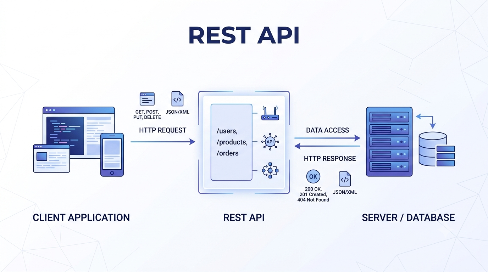
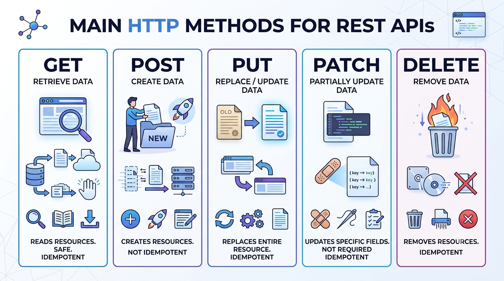
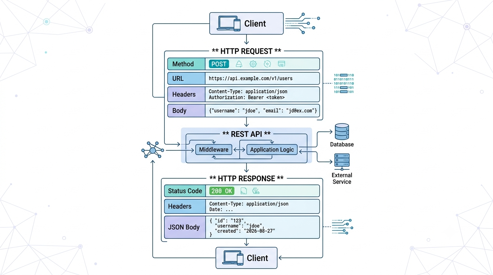
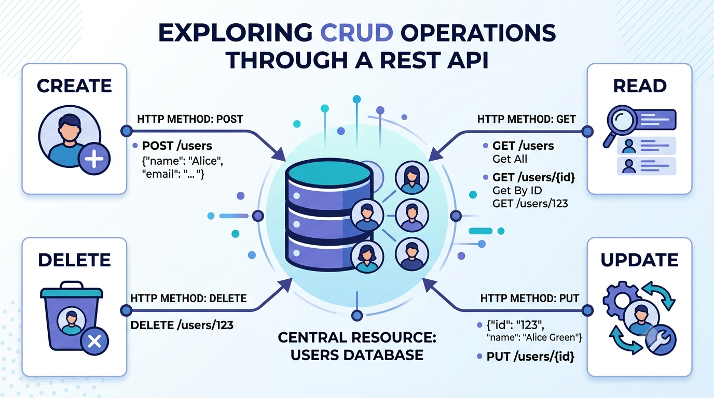
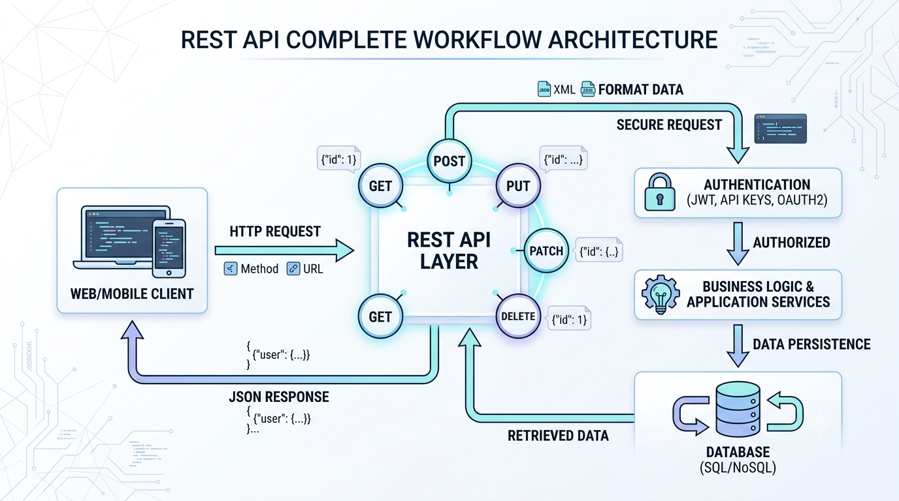

# REST API Explained: How Applications Communicate Over the Web

### A practical, beginner-friendly guide to REST APIs, HTTP methods, requests, responses, CRUD, and best practices

When you open a mobile app, browse an e-commerce website, check your bank balance, or order food online, something important is happening behind the scenes.

Your application needs to communicate with a server.

But how?

One of the most common answers is a **REST API**.

REST APIs provide a structured way for different software systems to communicate over the internet using familiar concepts such as URLs, HTTP methods, requests, and responses.

If you've ever seen something like:

```http
GET /users/123
```

or:

```http
POST /orders
```

you've already seen the basic idea behind REST APIs.

Let's break it down from the beginning.

---

# What Is a REST API?

REST stands for **Representational State Transfer**.

API stands for **Application Programming Interface**.

A REST API is an architectural style for designing web APIs that allows clients and servers to communicate using HTTP.

The simplest way to think about it is:

> **A REST API is a communication layer between an application and a server.**

For example, imagine a shopping application.

The application might need to:

- Get a list of products
- Get details about one product
- Create an order
- Update an order
- Delete an item

Instead of directly accessing the database, the application sends requests to the backend API.

The server processes those requests and sends responses back.

---

## REST API in One Picture



*Figure 1: A simplified view of how a client communicates with a server through a REST API.*

The basic communication looks like this:

```text
Client
   ↓
HTTP Request
   ↓
REST API
   ↓
Server / Database
   ↓
HTTP Response
   ↓
Client
```

The client could be:

- A web application
- A mobile application
- Another server
- A desktop application
- A command-line tool

The important thing is that the client doesn't need to know how the server internally works.

It only needs to know how to communicate with the API.

---

# Why Do We Need REST APIs?

Imagine building a mobile application that needs information from a company's database.

Should the mobile application connect directly to the database?

Usually, no.

That would create serious problems involving security, business logic, validation, and access control.

Instead, the application communicates with a backend service.

For example:

```text
Mobile App
    ↓
REST API
    ↓
Backend Logic
    ↓
Database
```

The API acts as a controlled gateway between the client and the backend.

This allows the server to decide:

- What data can be accessed
- Who can access it
- What operations are allowed
- How requests are validated
- How errors are handled

This separation is one of the major reasons APIs are so useful.

---

# How Does a REST API Work?

Let's use a simple example.

Suppose we have an API for managing users.

A client wants information about user `123`.

It might send:

```http
GET /users/123
```

The server receives the request.

It checks the request, finds the user, and returns a response.

For example:

```json
{
  "id": 123,
  "name": "Sarah Johnson",
  "email": "sarah@example.com"
}
```

The client can then use this information to display the user's profile.

The entire interaction is:

```text
Client
   ↓
GET /users/123
   ↓
REST API
   ↓
Find User
   ↓
Return JSON
   ↓
Client
```

That's the basic REST API workflow.

---

# The Client-Server Model

REST APIs commonly follow a **client-server architecture**.

The client is responsible for the user-facing experience.

The server is responsible for processing requests, applying business rules, and interacting with data sources.

For example:

```text
          CLIENT
     Web / Mobile App
             │
             │ HTTP
             ↓
          REST API
             │
             ↓
       Business Logic
             │
             ↓
          Database
```

The client and server can evolve independently as long as they continue to follow the agreed API contract.

For example, a company could redesign its mobile application without completely rewriting its backend API.

This separation makes large applications easier to maintain.

---

# Understanding HTTP Methods

One of the most important concepts in REST APIs is the use of **HTTP methods**.

HTTP methods tell the server what kind of operation the client wants to perform.

The most common methods are:

| Method | Common Purpose |
|---|---|
| `GET` | Retrieve data |
| `POST` | Create data |
| `PUT` | Replace a resource |
| `PATCH` | Partially update a resource |
| `DELETE` | Delete a resource |

---

# GET

`GET` is used to retrieve information.

For example:

```http
GET /users
```

This might return:

```json
[
  {
    "id": 1,
    "name": "Sarah"
  },
  {
    "id": 2,
    "name": "John"
  }
]
```

To retrieve a specific user:

```http
GET /users/123
```

The important idea is:

> **GET asks the server for information.**

---

# POST

`POST` is commonly used to create a new resource.

For example:

```http
POST /users
```

The request body might contain:

```json
{
  "name": "Sarah Johnson",
  "email": "sarah@example.com"
}
```

The server may respond:

```json
{
  "id": 101,
  "name": "Sarah Johnson",
  "email": "sarah@example.com"
}
```

The important idea is:

> **POST sends information to the server to create something new.**

---

# PUT

`PUT` is generally used to replace the representation of an existing resource.

For example:

```http
PUT /users/101
```

Request body:

```json
{
  "name": "Sarah Williams",
  "email": "sarah.williams@example.com"
}
```

Think of PUT as:

> **"Replace this resource with this representation."**

The exact behavior depends on the API design, so good documentation should clearly define what a PUT operation does.

---

# PATCH

`PATCH` is commonly used for partial updates.

Suppose the user only wants to change their email.

Instead of sending the complete user object, the client can send:

```http
PATCH /users/101
```

```json
{
  "email": "newemail@example.com"
}
```

The important idea is:

> **PATCH changes part of an existing resource.**

---

# DELETE

`DELETE` is used to remove a resource.

For example:

```http
DELETE /users/101
```

The server processes the request and may return:

```http
204 No Content
```

The important idea is:

> **DELETE asks the server to remove a resource.**

---

# HTTP Methods at a Glance



*Figure 2: The main HTTP methods and the operations they commonly represent in REST APIs.*

A useful mental model is:

```text
GET     → Read
POST    → Create
PUT     → Replace
PATCH   → Partially Update
DELETE  → Remove
```

These operations form the foundation of many REST APIs.

---

# Understanding API Requests

Every API interaction starts with a request.

A request can contain several important parts:

```text
HTTP Method
     +
URL
     +
Headers
     +
Query Parameters
     +
Request Body
```

For example:

```http
POST /users?notify=true
Authorization: Bearer YOUR_TOKEN
Content-Type: application/json

{
  "name": "Sarah Johnson",
  "email": "sarah@example.com"
}
```

Let's break this down.

### Method

```text
POST
```

Tells the server what operation is being requested.

### URL

```text
/users
```

Identifies the resource.

### Query Parameter

```text
notify=true
```

Provides additional options for the request.

### Header

```text
Authorization: Bearer YOUR_TOKEN
```

Provides authentication information.

### Body

```json
{
  "name": "Sarah Johnson",
  "email": "sarah@example.com"
}
```

Contains the data being sent to the server.

---

# Understanding API Responses

After processing a request, the server sends a response.

A response commonly contains:

```text
Status Code
     +
Headers
     +
Response Body
```

For example:

```http
HTTP/1.1 200 OK
Content-Type: application/json
```

```json
{
  "id": 101,
  "name": "Sarah Johnson",
  "email": "sarah@example.com"
}
```

The status code tells the client whether the request succeeded.

The response body contains the actual data.

---

# Request and Response Flow



*Figure 3: A REST API request contains information sent by the client, while the response contains the server's result.*

The complete interaction looks like:

```text
Client
   │
   │ HTTP Request
   │
   ↓
REST API
   │
   │ Process Request
   ↓
Server / Database
   │
   │ Generate Result
   ↓
REST API
   │
   │ HTTP Response
   ↓
Client
```

This request-response cycle is at the heart of web APIs.

---

# What Are HTTP Status Codes?

Status codes provide a quick way to understand what happened after a request.

They are grouped into categories.

| Range | Meaning |
|---|---|
| `1xx` | Informational |
| `2xx` | Successful |
| `3xx` | Redirection |
| `4xx` | Client-side error |
| `5xx` | Server-side error |

Some common examples are:

### 200 OK

The request was successful.

### 201 Created

A new resource was successfully created.

### 204 No Content

The request succeeded, but there is no response body.

### 400 Bad Request

The request contains invalid or unacceptable data.

### 401 Unauthorized

Authentication is missing or invalid.

### 403 Forbidden

The server understood the request but refuses to authorize it.

### 404 Not Found

The requested resource could not be found.

### 429 Too Many Requests

The client has exceeded a rate limit.

### 500 Internal Server Error

Something went wrong on the server.

Understanding these codes makes debugging API problems much easier.

---

# What Is JSON?

REST APIs commonly use **JSON** to exchange data.

JSON stands for **JavaScript Object Notation**.

For example:

```json
{
  "id": 101,
  "name": "Sarah Johnson",
  "email": "sarah@example.com",
  "active": true
}
```

JSON is popular because it is:

- Easy for humans to read
- Easy for applications to parse
- Lightweight
- Supported by many programming languages

A REST API isn't required to use JSON, but JSON is extremely common in modern web APIs.

---

# Path Parameters

Path parameters are values included directly in the URL path.

For example:

```http
GET /users/101
```

Here:

```text
101
```

is the user ID.

Another example:

```http
GET /products/500
```

The API documentation might describe the endpoint as:

```http
GET /products/{productId}
```

Where:

```text
productId = 500
```

Path parameters are useful when identifying a specific resource.

---

# Query Parameters

Query parameters are added after a `?` in the URL.

For example:

```http
GET /users?limit=20
```

Here:

```text
limit=20
```

is a query parameter.

Multiple parameters can be combined:

```http
GET /users?limit=20&sort=name
```

Query parameters are commonly used for:

- Filtering
- Sorting
- Pagination
- Searching
- Optional configuration

For example:

```http
GET /products?category=electronics&limit=10
```

This could request up to ten electronic products.

---

# Headers

Headers provide additional information about an HTTP request or response.

Common request headers include:

```http
Authorization: Bearer YOUR_TOKEN
Content-Type: application/json
Accept: application/json
```

### Authorization

Used to provide authentication credentials.

### Content-Type

Tells the server what format the request body uses.

### Accept

Indicates what response formats the client can handle.

Headers may seem small, but they carry important metadata that helps the client and server communicate correctly.

---

# CRUD Operations

A common way to understand REST APIs is through **CRUD**.

CRUD stands for:

- **Create**
- **Read**
- **Update**
- **Delete**

These operations map naturally to common HTTP methods.

For example, imagine an API managing users.

```text
CREATE
POST /users

READ
GET /users

UPDATE
PUT /users/{id}

DELETE
DELETE /users/{id}
```

This gives us a simple relationship:

```text
CRUD
 │
 ├── Create → POST
 ├── Read   → GET
 ├── Update → PUT / PATCH
 └── Delete → DELETE
```

---

# CRUD in One Visual



*Figure 4: CRUD operations mapped to common REST API methods.*

CRUD isn't a strict REST rule, but it is a very useful mental model for understanding resource-based APIs.

---

# A Complete REST API Example

Let's design a small API for managing books.

## Get All Books

```http
GET /books
```

Response:

```json
[
  {
    "id": 1,
    "title": "Clean Code",
    "author": "Robert C. Martin"
  },
  {
    "id": 2,
    "title": "The Pragmatic Programmer",
    "author": "Andrew Hunt"
  }
]
```

---

## Get One Book

```http
GET /books/1
```

Response:

```json
{
  "id": 1,
  "title": "Clean Code",
  "author": "Robert C. Martin"
}
```

---

## Create a Book

```http
POST /books
```

Request:

```json
{
  "title": "Designing Data-Intensive Applications",
  "author": "Martin Kleppmann"
}
```

Response:

```http
201 Created
```

```json
{
  "id": 3,
  "title": "Designing Data-Intensive Applications",
  "author": "Martin Kleppmann"
}
```

---

## Update a Book

```http
PATCH /books/3
```

Request:

```json
{
  "title": "Designing Data-Intensive Applications - Updated Edition"
}
```

---

## Delete a Book

```http
DELETE /books/3
```

Response:

```http
204 No Content
```

Now we have a complete CRUD-style REST API.

---

# What Does Stateless Mean?

One of the important ideas associated with REST is **statelessness**.

Stateless means that each request should contain the information necessary for the server to understand and process that request.

The server shouldn't have to depend on hidden client state stored from a previous request.

For example:

```text
Request 1
   ↓
Server processes it

Request 2
   ↓
Server processes it independently
```

This makes systems easier to scale because requests can generally be handled by different server instances without requiring a specific server to remember the client's previous request.

Authentication tokens are commonly sent with each request when authentication is required.

---

# REST API Authentication

Many REST APIs require authentication.

A common approach is using a bearer token.

For example:

```http
Authorization: Bearer YOUR_ACCESS_TOKEN
```

The client includes the token with its request.

The server verifies the token before processing the request.

A simplified flow looks like:

```text
Client
   ↓
Request + Access Token
   ↓
Authentication
   ↓
Authorization
   ↓
Business Logic
   ↓
Response
```

Authentication answers:

> **"Who are you?"**

Authorization answers:

> **"Are you allowed to do this?"**

These concepts are related but not identical.

---

# REST API Versioning

APIs evolve over time.

A company may introduce a new version without immediately breaking existing applications.

For example:

```text
https://api.example.com/v1/users
```

and:

```text
https://api.example.com/v2/users
```

Versioning helps developers understand which API contract they are using.

Good API versioning documentation should explain:

- Current version
- Supported versions
- Deprecated versions
- Breaking changes
- Migration instructions

This becomes especially important for public APIs used by many external developers.

---

# REST API Best Practices

A REST API can work technically and still be difficult to use.

Good API design focuses on clarity and consistency.

Here are some useful principles.

## Use Nouns for Resources

Prefer:

```http
GET /users
GET /products
GET /orders
```

instead of:

```http
GET /getUsers
GET /getProducts
GET /getOrders
```

The HTTP method already communicates the operation.

---

## Use Consistent Naming

If one endpoint uses:

```text
/user-profiles
```

avoid randomly using:

```text
/customerData
```

for a similar resource.

Consistent naming makes APIs easier to learn.

---

## Use Appropriate Status Codes

Don't return:

```http
200 OK
```

for every situation.

Use meaningful status codes so clients can understand what happened.

---

## Validate Input

Never assume that client input is correct.

The server should validate incoming data before processing it.

For example:

```json
{
  "email": "not-an-email"
}
```

should not silently become an invalid user record.

---

## Provide Useful Error Responses

Instead of returning:

```json
{
  "error": "Something went wrong"
}
```

provide useful information:

```json
{
  "error": {
    "code": "INVALID_EMAIL",
    "message": "The provided email address is invalid."
  }
}
```

Useful errors make debugging much easier.

---

# Common REST API Mistakes

## 1. Using the Wrong HTTP Method

For example, using `GET` to perform a destructive operation can create confusion and unexpected behavior.

Use methods according to their intended semantics.

---

## 2. Returning Inconsistent Responses

One endpoint returns:

```json
{
  "user": {}
}
```

while another similar endpoint returns:

```json
{
  "data": {}
}
```

Inconsistency increases the amount of code developers need to write and understand.

---

## 3. Poor Error Messages

An error such as:

```text
Invalid request
```

doesn't tell the developer much.

Explain what was wrong and, when appropriate, how to fix it.

---

## 4. Exposing Internal Implementation Details

Clients generally shouldn't need to know the exact structure of your internal database.

The API should provide a stable contract rather than exposing internal implementation unnecessarily.

---

## 5. Ignoring Pagination

Returning thousands of records in one response can hurt performance.

For large collections, APIs commonly support pagination.

For example:

```http
GET /products?page=2&limit=20
```

This allows clients to retrieve manageable amounts of data.

---

# REST API vs Traditional Web Pages

A REST API is different from a traditional web page.

A traditional web page might return HTML:

```html
<h1>Welcome, Sarah</h1>
```

An API might return structured data:

```json
{
  "name": "Sarah"
}
```

The API response can then be consumed by:

- Web applications
- Mobile apps
- Other APIs
- Desktop applications
- Automated systems

The client decides how to present the data.

This separation is one reason APIs are useful in modern software systems.

---

# The Complete REST API Architecture

We've now covered the individual pieces.

Let's put everything together.



*Figure 5: A simplified real-world REST API architecture connecting clients, authentication, backend logic, and a database.*

A typical architecture might look like:

```text
             Web / Mobile Client
                     │
                     │ HTTP Request
                     ↓
                REST API
                     │
             Authentication
                     │
                     ↓
              Business Logic
                     │
                     ↓
                  Database
                     │
                     ↓
              Business Logic
                     │
                     ↓
                REST API
                     │
                     │ JSON Response
                     ↓
             Web / Mobile Client
```

The API provides the communication boundary between the client and the backend system.

---

# A Simple Mental Model

If REST APIs still feel complicated, remember this:

```text
RESOURCE
   ↓
URL

ACTION
   ↓
HTTP METHOD

DATA
   ↓
REQUEST BODY

RESULT
   ↓
RESPONSE

OUTCOME
   ↓
STATUS CODE
```

For example:

```http
POST /users
```

means:

> Create a user.

While:

```http
GET /users/101
```

means:

> Give me user 101.

And:

```http
DELETE /users/101
```

means:

> Remove user 101.

Once this pattern becomes familiar, REST APIs become much easier to understand.

---

# Final Takeaway

REST APIs provide a structured way for software systems to communicate over HTTP.

The core concepts are straightforward:

**URLs identify resources.**

**HTTP methods describe operations.**

**Requests carry information to the server.**

**Responses carry results back to the client.**

**Status codes communicate outcomes.**

**JSON commonly carries structured data.**

**Authentication controls access.**

**CRUD provides a useful model for common resource operations.**

The most important thing to remember is that a REST API is not just a collection of URLs.

It is a **contract between software systems**.

The client needs to know:

> Where do I send the request?

> What method should I use?

> What data should I send?

> What response should I expect?

> What happens if something goes wrong?

A well-designed REST API answers these questions consistently.

And when the API is paired with clear documentation, developers can spend less time figuring out how the system works and more time building useful applications with it.

> **A good REST API doesn't just move data. It creates a predictable way for software to communicate.**

---

# Quick REST API Cheat Sheet

| Concept | Example |
|---|---|
| Resource | `/users` |
| Get collection | `GET /users` |
| Get one resource | `GET /users/123` |
| Create | `POST /users` |
| Replace | `PUT /users/123` |
| Partial update | `PATCH /users/123` |
| Delete | `DELETE /users/123` |
| Success | `200 OK` |
| Created | `201 Created` |
| No content | `204 No Content` |
| Client error | `400 Bad Request` |
| Unauthorized | `401 Unauthorized` |
| Forbidden | `403 Forbidden` |
| Not found | `404 Not Found` |
| Rate limited | `429 Too Many Requests` |
| Server error | `500 Internal Server Error` |

---

## Key Concepts

`REST` · `API` · `HTTP` · `GET` · `POST` · `PUT` · `PATCH` · `DELETE` · `CRUD` · `JSON` · `HTTP Status Codes` · `Authentication` · `Client-Server Architecture`

---

## References

- MDN Web Docs: HTTP
- RFC 9110: HTTP Semantics
- Roy T. Fielding, *Architectural Styles and the Design of Network-based Software Architectures*
- OpenAPI Specification
