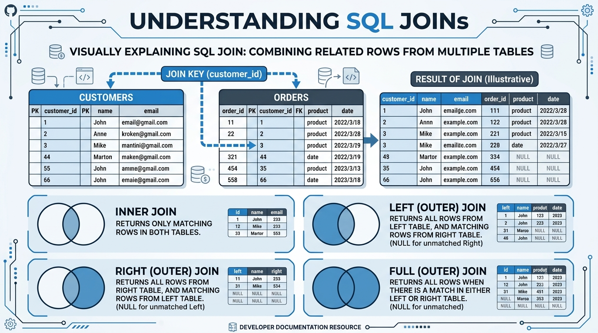
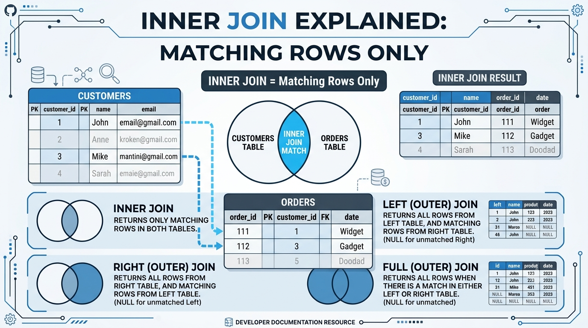
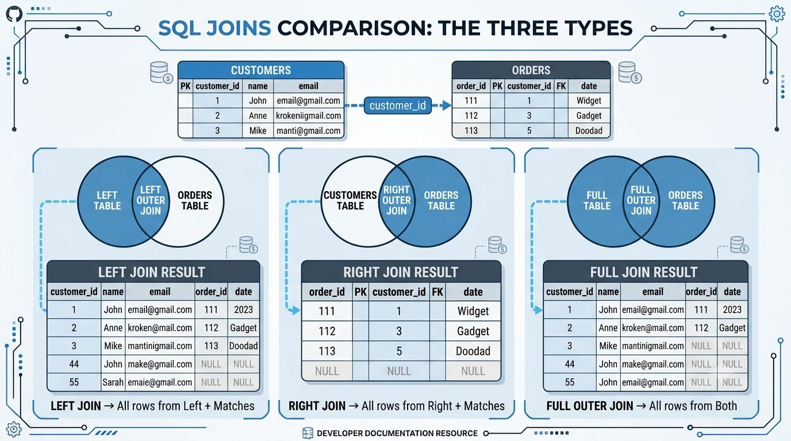
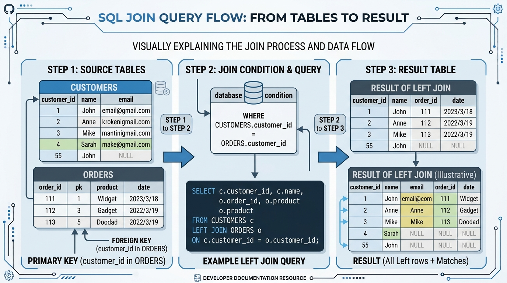
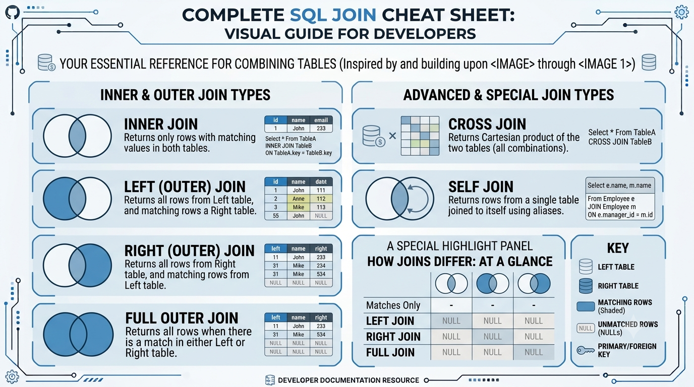

# SQL JOINs Explained

### A practical guide to understanding and using SQL JOINs with real-world examples

When working with databases, information is rarely stored in a single table.

A typical application may have separate tables for:

- Customers
- Orders
- Products
- Employees
- Departments
- Payments

But what happens when we need information from multiple tables?

For example:

> "Show the names of all customers along with the orders they have placed."

The customer information may be stored in one table, while the order information exists in another.

This is where **SQL JOINs** come in.

A JOIN allows us to combine related data from multiple tables using a common column or relationship.

---

# What Is a SQL JOIN?

A SQL JOIN combines rows from two or more tables based on a related column.

For example, imagine we have two tables.

### Customers

| customer_id | name |
|---|---|
| 1 | Rahul |
| 2 | Priya |
| 3 | Amit |

### Orders

| order_id | customer_id | amount |
|---|---|---:|
| 101 | 1 | 500 |
| 102 | 2 | 800 |
| 103 | 1 | 300 |

Both tables contain `customer_id`.

This common column allows us to connect the tables.

```sql
SELECT customers.name, orders.amount
FROM customers
JOIN orders
    ON customers.customer_id = orders.customer_id;
```

The result would be:

| name | amount |
|---|---:|
| Rahul | 500 |
| Priya | 800 |
| Rahul | 300 |

The JOIN connects the related records.

---

# Why Do We Need JOINs?

Relational databases usually divide information into multiple tables.

For example:

```text
Customers
    |
    | customer_id
    ↓
Orders
    |
    | product_id
    ↓
Products
```

This keeps data organized and reduces unnecessary duplication.

However, when we need information from several tables, we need a way to combine that information.

That is the purpose of JOINs.



*Figure 1: SQL JOINs connect related information stored in different tables.*

---

# Types of SQL JOINs

The major SQL JOIN types are:

- `INNER JOIN`
- `LEFT JOIN`
- `RIGHT JOIN`
- `FULL OUTER JOIN`
- `CROSS JOIN`
- `SELF JOIN`

A simple way to think about JOINs is:

```text
Multiple Tables
       ↓
Related Columns
       ↓
JOIN Condition
       ↓
Choose JOIN Type
       ↓
Combined Result
```

---

# INNER JOIN

An **INNER JOIN** returns only the rows that have matching values in both tables.

In simple terms:

> Give me only the records that exist on both sides.

Suppose we have:

### Customers

| customer_id | name |
|---|---|
| 1 | Rahul |
| 2 | Priya |
| 3 | Amit |

### Orders

| order_id | customer_id |
|---|---|
| 101 | 1 |
| 102 | 2 |
| 103 | 1 |
| 104 | 5 |

Customer IDs `1` and `2` have matching records.

Customer ID `5` exists in the Orders table but not in Customers.

Now consider:

```sql
SELECT customers.name, orders.order_id
FROM customers
INNER JOIN orders
    ON customers.customer_id = orders.customer_id;
```

Result:

| name | order_id |
|---|---:|
| Rahul | 101 |
| Priya | 102 |
| Rahul | 103 |

The order with ID `104` is not returned because there is no matching customer.



*Figure 2: INNER JOIN returns only rows that have matching records in both tables.*

### When should you use INNER JOIN?

Use an INNER JOIN when you only want records that have a relationship in both tables.

Examples:

- Customers who have placed orders
- Employees who belong to departments
- Students enrolled in courses
- Products that have reviews

---

# LEFT JOIN

A **LEFT JOIN** returns:

> All rows from the left table + matching rows from the right table.

If there is no match, SQL returns `NULL` for the columns coming from the right table.

For example:

```sql
SELECT customers.name, orders.order_id
FROM customers
LEFT JOIN orders
    ON customers.customer_id = orders.customer_id;
```

Suppose:

### Customers

| customer_id | name |
|---|---|
| 1 | Rahul |
| 2 | Priya |
| 3 | Amit |

### Orders

| order_id | customer_id |
|---|---|
| 101 | 1 |
| 102 | 2 |

The result is:

| name | order_id |
|---|---:|
| Rahul | 101 |
| Priya | 102 |
| Amit | NULL |

Amit is included even though Amit has no order.

Why?

Because `Customers` is the **left table**, and LEFT JOIN preserves every row from that table.

---

# RIGHT JOIN

A **RIGHT JOIN** is essentially the opposite of a LEFT JOIN.

It returns:

> All rows from the right table + matching rows from the left table.

Example:

```sql
SELECT customers.name, orders.order_id
FROM customers
RIGHT JOIN orders
    ON customers.customer_id = orders.customer_id;
```

If an order exists without a matching customer, the order can still appear.

For example:

| name | order_id |
|---|---:|
| Rahul | 101 |
| Priya | 102 |
| NULL | 103 |

Here, the order with ID `103` is preserved because `Orders` is the right table.

---

# FULL OUTER JOIN

A **FULL OUTER JOIN** returns all rows from both tables.

Matching rows are combined.

Rows without matches are still included, with `NULL` values where necessary.

Example:

```sql
SELECT customers.name, orders.order_id
FROM customers
FULL OUTER JOIN orders
    ON customers.customer_id = orders.customer_id;
```

Conceptually:

```text
Customers only
      +
Matching records
      +
Orders only
```

FULL OUTER JOIN is useful when you want the complete set of records from both tables.



*Figure 3: LEFT, RIGHT, and FULL OUTER JOINs differ in which unmatched rows they preserve.*

---

# LEFT JOIN vs RIGHT JOIN vs FULL OUTER JOIN

A simple way to remember them:

```text
LEFT JOIN
→ Keep everything from the left table

RIGHT JOIN
→ Keep everything from the right table

FULL OUTER JOIN
→ Keep everything from both tables
```

When deciding which one to use, ask:

> Which table's unmatched rows do I want to keep?

---

# Understanding the JOIN Condition

The `ON` condition is one of the most important parts of a JOIN query.

Consider:

```sql
SELECT *
FROM customers
JOIN orders
    ON customers.customer_id = orders.customer_id;
```

The database compares:

```text
customers.customer_id
          =
orders.customer_id
```

If the values match, the records can be combined.

For example:

```text
Customer ID: 10
      =
Order Customer ID: 10

        ↓

      MATCH
```

But:

```text
Customer ID: 10
      ≠
Order Customer ID: 25

        ↓

    NO MATCH
```

The type of JOIN determines what happens to unmatched rows.

---

# SQL JOIN Query Flow



*Figure 4: A JOIN connects tables through related columns and produces a combined result.*

A JOIN can be understood as:

```text
Table A
   +
Table B
   ↓
Compare Related Columns
   ↓
Apply JOIN Condition
   ↓
Choose Which Rows to Keep
   ↓
Combined Result
```

This mental model makes JOIN queries much easier to understand.

---

# CROSS JOIN

A **CROSS JOIN** is different from the JOINs discussed above.

It produces every possible combination of rows from two tables.

Suppose we have:

### Colors

| color |
|---|
| Red |
| Blue |

### Sizes

| size |
|---|
| Small |
| Large |

A CROSS JOIN:

```sql
SELECT colors.color, sizes.size
FROM colors
CROSS JOIN sizes;
```

produces:

| color | size |
|---|---|
| Red | Small |
| Red | Large |
| Blue | Small |
| Blue | Large |

The number of combinations is:

```text
2 colors × 2 sizes = 4 rows
```

This is known as a **Cartesian product**.

Be careful with CROSS JOINs on large tables because the result can become very large very quickly.

---

# SELF JOIN

A **SELF JOIN** occurs when a table is joined with itself.

This is useful when rows in the same table have relationships with other rows in that same table.

A common example is an employee-manager hierarchy.

### Employees

| employee_id | name | manager_id |
|---|---|---|
| 1 | Rahul | NULL |
| 2 | Priya | 1 |
| 3 | Amit | 1 |

Here, `manager_id` refers to another employee in the same table.

We can use:

```sql
SELECT
    employee.name AS employee,
    manager.name AS manager
FROM employees AS employee
LEFT JOIN employees AS manager
    ON employee.manager_id = manager.employee_id;
```

Result:

| employee | manager |
|---|---|
| Rahul | NULL |
| Priya | Rahul |
| Amit | Rahul |

The table is used twice with different aliases.

---

# Why Use Table Aliases?

Table aliases make JOIN queries shorter and easier to read.

Instead of:

```sql
SELECT customers.name, orders.order_id
FROM customers
JOIN orders
    ON customers.customer_id = orders.customer_id;
```

we can write:

```sql
SELECT c.name, o.order_id
FROM customers AS c
JOIN orders AS o
    ON c.customer_id = o.customer_id;
```

Here:

```text
c → customers
o → orders
```

Aliases become especially useful when working with several tables.

---

# Joining More Than Two Tables

JOINs are not limited to two tables.

We can join three or more tables.

For example:

```text
Customers
    ↓
Orders
    ↓
Products
```

A query could be:

```sql
SELECT
    c.name,
    o.order_id,
    p.product_name
FROM customers AS c
JOIN orders AS o
    ON c.customer_id = o.customer_id
JOIN products AS p
    ON o.product_id = p.product_id;
```

Here, the query combines information from:

1. Customers
2. Orders
3. Products

The result could tell us:

> Which customer purchased which product?

---

# JOINs and NULL Values

`NULL` is especially important when using OUTER JOINs.

Consider:

```sql
SELECT c.name, o.order_id
FROM customers AS c
LEFT JOIN orders AS o
    ON c.customer_id = o.customer_id;
```

If a customer has no order, the result might be:

| name | order_id |
|---|---|
| Amit | NULL |

`NULL` does not mean zero.

It means that there is no value available for that column in the result.

To find NULL values, use:

```sql
WHERE column_name IS NULL
```

For example:

```sql
SELECT c.name
FROM customers AS c
LEFT JOIN orders AS o
    ON c.customer_id = o.customer_id
WHERE o.order_id IS NULL;
```

This query finds customers who haven't placed any orders.

---

# A Practical Example

Suppose we have:

### Customers

```text
customer_id
name
```

### Orders

```text
order_id
customer_id
amount
```

The requirement is:

> Find all customers and show their order amount if they have placed an order.

A LEFT JOIN is appropriate because we want **all customers**, including customers without orders.

```sql
SELECT
    c.name,
    o.amount
FROM customers AS c
LEFT JOIN orders AS o
    ON c.customer_id = o.customer_id;
```

Possible result:

| name | amount |
|---|---:|
| Rahul | 500 |
| Priya | 800 |
| Amit | NULL |

This is a common real-world use of LEFT JOIN.

---

# Finding Records Without a Match

Another very useful SQL pattern is finding records that don't have a related record.

For example:

> Find customers who haven't placed an order.

We can write:

```sql
SELECT c.name
FROM customers AS c
LEFT JOIN orders AS o
    ON c.customer_id = o.customer_id
WHERE o.customer_id IS NULL;
```

The logic is:

```text
Keep all customers
       ↓
Try to match orders
       ↓
Find rows where order is NULL
       ↓
Customers without orders
```

This pattern appears frequently in real-world database queries.

---

# JOIN vs WHERE

JOIN conditions and filtering conditions serve different purposes.

Consider:

```sql
SELECT c.name, o.amount
FROM customers AS c
JOIN orders AS o
    ON c.customer_id = o.customer_id
WHERE o.amount > 500;
```

The `ON` clause defines the relationship:

```sql
ON c.customer_id = o.customer_id
```

The `WHERE` clause filters the resulting rows:

```sql
WHERE o.amount > 500
```

A useful mental model is:

```text
ON
↓
Defines the relationship

WHERE
↓
Filters the result
```

This distinction becomes particularly important when working with OUTER JOINs.

---

# JOIN Performance

JOINs are extremely powerful, but performance matters when working with large databases.

Some factors that can affect JOIN performance include:

- Table size
- Join conditions
- Indexes
- Query structure
- Number of rows
- Database engine
- Data distribution

Indexes on columns frequently used for JOIN conditions can often help the database locate matching rows more efficiently.

For example:

```sql
CREATE INDEX idx_orders_customer_id
ON orders(customer_id);
```

However, indexing isn't automatically beneficial in every situation.

Database performance should be measured using the actual workload and query execution plans.

---

# How to Choose the Right JOIN

When writing a JOIN query, ask:

> **Which rows do I want to keep?**

Use this decision process:

```text
Do I only want matching rows?
        ↓
   INNER JOIN

Do I want every row from the first table?
        ↓
    LEFT JOIN

Do I want every row from the second table?
        ↓
   RIGHT JOIN

Do I want everything from both tables?
        ↓
 FULL OUTER JOIN

Do I want every possible combination?
        ↓
   CROSS JOIN

Do rows relate to other rows
in the same table?
        ↓
    SELF JOIN
```

This is often easier than memorizing JOIN definitions.

---

# SQL JOIN Cheat Sheet



*Figure 5: Quick visual reference for the major SQL JOIN types.*

| JOIN | What It Returns | Common Use |
|---|---|---|
| INNER JOIN | Matching rows | Records existing in both tables |
| LEFT JOIN | All left + matching right | Keep every record from the main table |
| RIGHT JOIN | All right + matching left | Keep every record from the right table |
| FULL OUTER JOIN | All rows from both | Compare complete datasets |
| CROSS JOIN | Every possible combination | Generate combinations |
| SELF JOIN | Table joined with itself | Hierarchies and relationships |

---

# Common SQL JOIN Mistakes

## 1. Forgetting the JOIN Condition

A JOIN without an appropriate relationship can produce an unintended Cartesian product.

For a normal relational JOIN, specify how the tables are related:

```sql
JOIN orders
    ON customers.customer_id = orders.customer_id
```

---

## 2. Joining on the Wrong Column

Suppose you accidentally write:

```sql
ON customers.customer_id = orders.order_id
```

The query may still execute successfully.

But the result can be logically incorrect.

SQL does not automatically know whether your chosen relationship makes business sense.

Understanding the database schema is therefore essential.

---

## 3. Using INNER JOIN When You Need All Records

Suppose the requirement is:

> Show every customer, including customers who haven't ordered anything.

Using:

```sql
INNER JOIN
```

would remove customers without orders.

A:

```sql
LEFT JOIN
```

would be more appropriate.

---

## 4. Unexpected Duplicate Rows

Suppose one customer has five orders.

A JOIN between customers and orders can return five rows for that customer.

This is not necessarily an error.

It is a natural result of a one-to-many relationship:

```text
1 Customer
    ↓
5 Orders
```

The customer therefore appears across multiple result rows.

---

# JOINs in Real-World Applications

SQL JOINs are used in almost every relational database application.

## E-Commerce

```text
Customers
    ↓
Orders
    ↓
Products
```

JOINs can show which customer bought which product.

## Banking

```text
Customers
    ↓
Accounts
    ↓
Transactions
```

JOINs can combine customer and transaction information.

## Education

```text
Students
    ↓
Enrollments
    ↓
Courses
```

JOINs can show which students are enrolled in which courses.

## Company Management

```text
Employees
    ↓
Departments
```

JOINs can connect employees with their departments.

The pattern is always similar:

```text
Related Tables
      ↓
Common Relationship
      ↓
JOIN
      ↓
Useful Combined Data
```

---

# Quick JOIN Comparison

| JOIN Type | Matching Rows | Left Unmatched | Right Unmatched |
|---|---|---|---|
| INNER JOIN | Yes | No | No |
| LEFT JOIN | Yes | Yes | No |
| RIGHT JOIN | Yes | No | Yes |
| FULL OUTER JOIN | Yes | Yes | Yes |
| CROSS JOIN | All combinations | Not applicable | Not applicable |
| SELF JOIN | Depends on condition | Depends | Depends |

This table is useful when you need a quick reminder during SQL practice or interviews.

---

# Interview Tip

A common SQL interview question is:

> What is the difference between INNER JOIN and LEFT JOIN?

A simple answer is:

**INNER JOIN returns only matching rows from both tables.**

**LEFT JOIN returns every row from the left table and matching rows from the right table. If there is no match, the right-side columns contain NULL.**

Another common question is:

> How do you find customers who have no orders?

A common solution is:

```sql
SELECT c.name
FROM customers c
LEFT JOIN orders o
    ON c.customer_id = o.customer_id
WHERE o.order_id IS NULL;
```

Understanding the logic behind this query is more valuable than simply memorizing it.

---

# Final Takeaway

SQL JOINs are one of the most important concepts in relational databases.

They allow us to combine related information stored across multiple tables.

The major JOIN types are:

```text
INNER JOIN
LEFT JOIN
RIGHT JOIN
FULL OUTER JOIN
CROSS JOIN
SELF JOIN
```

Remember:

```text
INNER JOIN
→ Matching rows only

LEFT JOIN
→ Everything from the left + matches from the right

RIGHT JOIN
→ Everything from the right + matches from the left

FULL OUTER JOIN
→ Everything from both

CROSS JOIN
→ Every possible combination

SELF JOIN
→ Table joined with itself
```

The easiest way to choose a JOIN is not to memorize complicated definitions.

Instead, ask:

> **Which rows do I want to keep?**

Once you answer that question, choosing the JOIN becomes much easier.

---

# Conclusion

JOINs may look complicated when you first encounter them, but the underlying idea is straightforward.

You have multiple tables.

Those tables have relationships.

You define those relationships using an `ON` condition.

Then you choose the JOIN type based on which rows you want in the final result.

The complete process can be summarized as:

```text
Multiple Tables
       ↓
Related Columns
       ↓
JOIN Condition
       ↓
Choose JOIN Type
       ↓
Combined Result
       ↓
Filter / Analyze / Use the Data
```

The best way to become comfortable with JOINs is to practice them with real datasets.

Start with two tables.

Understand INNER JOIN.

Then move to LEFT JOIN.

After that, practice RIGHT JOIN and FULL OUTER JOIN.

Finally, explore CROSS JOIN, SELF JOIN, and multi-table JOINs.

> **Don't memorize JOINs as complicated SQL syntax. Think about which rows you want to keep, then choose the JOIN that preserves them.**

---

# Key Principles

```text
Understand the table relationships
              +
Choose the correct JOIN
              +
Write the JOIN condition
              +
Filter the result
              =
Useful relational data
```

---

## References

- PostgreSQL Documentation
- MySQL Documentation
- Microsoft SQL Server Documentation
- SQL Standard Documentation
