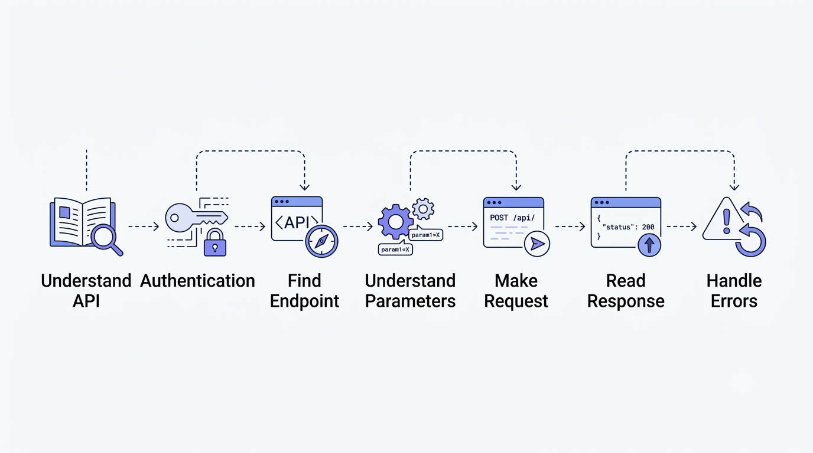
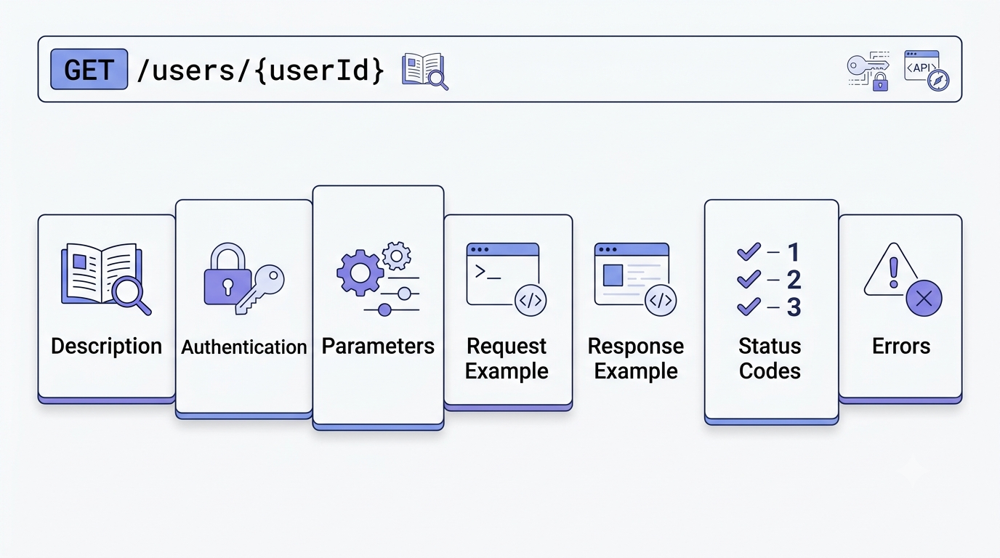
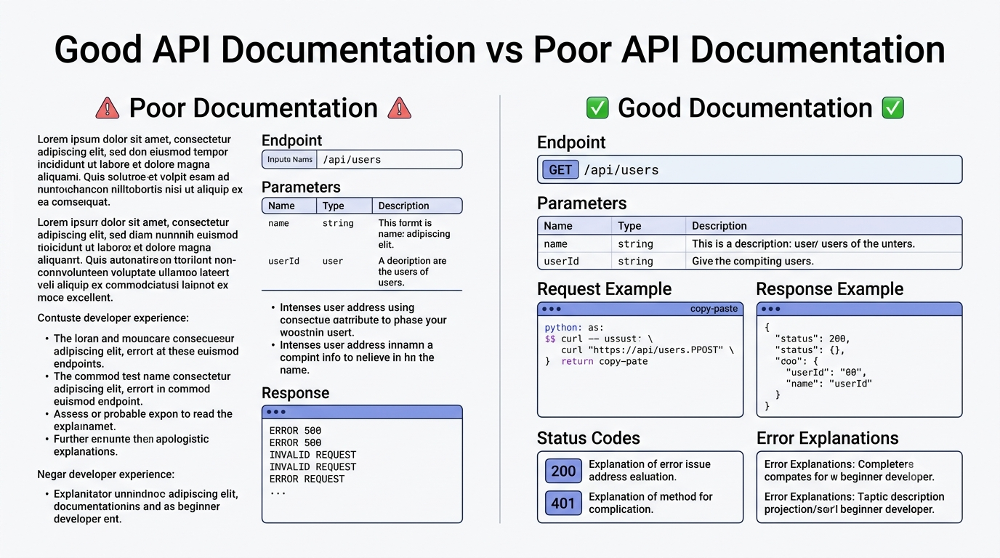
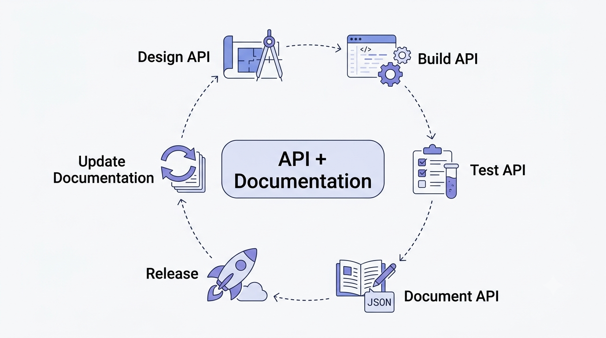
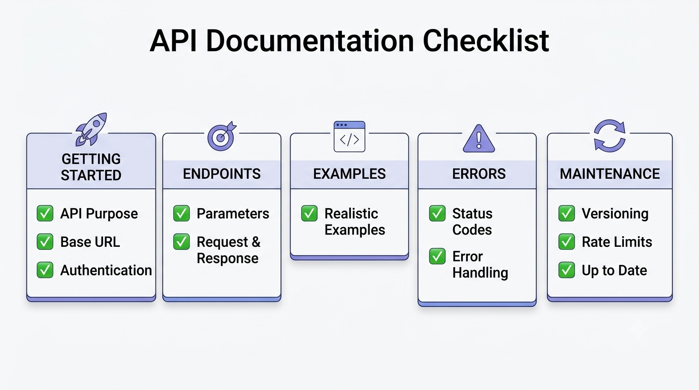

# Writing Better API Documentation

### A practical guide to creating clear, useful, and developer-friendly API documentation

Imagine you find an API that does exactly what you need.

You have the API key.  
You have the endpoint.  
You even know what you want to build.

You open the documentation and see:

```http
POST /api/v1/users
```

That's it.

Now you're left wondering:

- What data should I send?
- Where does the API key go?
- Which fields are required?
- What does the response look like?
- What happens if something goes wrong?
- What does a `400` or `401` error mean?

The API itself might be perfectly designed.

But if the documentation doesn't answer these questions, using the API becomes unnecessarily difficult.

That's why **good API documentation matters**.

Good documentation doesn't simply describe an API.

It helps developers **successfully use it**.

---

# What Is API Documentation?

API documentation is a guide that explains how developers can communicate with an API.

It usually covers:

- Endpoints
- HTTP methods
- Authentication
- Parameters
- Request formats
- Response formats
- Status codes
- Error messages
- Rate limits
- Examples

Think of an API as a restaurant.

The API is the kitchen.

The developer is the customer.

The documentation is the **menu**.

A menu doesn't explain every detail of how the kitchen works internally.

Instead, it tells you:

> What can I order?
>
> What do I need to provide?
>
> What will I receive?

Good API documentation does the same thing for software.

---

# What Makes API Documentation Good?

The goal is simple:

> A developer who has never used the API should be able to make their first successful request without constantly asking for help.

A typical documentation journey looks like this:

```text
Understand the API
        ↓
Get Authentication
        ↓
Find an Endpoint
        ↓
Understand Parameters
        ↓
Make a Request
        ↓
Read a Response
        ↓
Handle Errors
```

### Visualizing the Developer Journey



*Figure 1: The typical journey a developer follows when working with an API.*

The documentation should support the developer at every step of this journey.

---

# 1. Start With a Clear Overview

Before showing dozens of endpoints, explain what the API actually does.

For example:

> The Customer API allows applications to create, retrieve, update, and delete customer information.

That's much more useful than simply writing:

> Customer API v1

A good overview should quickly answer:

- What does this API do?
- Who is it designed for?
- What kind of data does it handle?
- What is the current version?
- What is the base URL?
- How does authentication work?

For example:

```text
Base URL:
https://api.example.com/v1

Authentication:
Bearer Token

Content Type:
application/json
```

This gives developers the basic information they need before they start making requests.

---

# 2. Explain Authentication Early

Authentication is usually one of the first things developers need.

Don't hide it at the bottom of the documentation.

Suppose your API uses a bearer token.

Instead of writing:

> Authentication required.

show developers exactly what they need to do.

### Example

```http
Authorization: Bearer YOUR_API_TOKEN
```

You can also provide a complete request:

```bash
curl https://api.example.com/v1/users \
  -H "Authorization: Bearer YOUR_API_TOKEN"
```

Now the developer knows:

- Where the token goes
- What authentication method is used
- What the request should look like

That's much more useful than a one-line description.

---

# 3. Make Endpoints Easy to Understand

An endpoint is one of the most important parts of API documentation.

A developer should immediately understand:

```text
What does this endpoint do?
How do I call it?
What do I send?
What do I get back?
```

For example:

## Get a User

```http
GET /users/{userId}
```

### Description

Returns information about a specific user.

### Authentication

Bearer token required.

### Path Parameter

| Parameter | Type | Required | Description |
|---|---|---|---|
| `userId` | string | Yes | Unique identifier of the user |

### Example Request

```bash
curl https://api.example.com/v1/users/12345 \
  -H "Authorization: Bearer YOUR_API_TOKEN"
```

### Example Response

```json
{
  "id": "12345",
  "name": "John Doe",
  "email": "john@example.com",
  "active": true
}
```

Now the developer can understand the endpoint without reading a huge paragraph.

---

# 4. Use a Consistent Structure

Imagine one endpoint is documented like this:

```text
GET /users
Description
Parameters
Example
```

And another one looks like this:

```text
POST /products
Notes
Request
Response
Authentication
```

The information might be correct, but the inconsistent structure makes the documentation harder to scan.

A better approach is to use the same structure for every endpoint.

```text
Endpoint
   ↓
Description
   ↓
Authentication
   ↓
Parameters
   ↓
Request Example
   ↓
Response Example
   ↓
Status Codes
   ↓
Errors
```

### A Consistent Endpoint Structure



*Figure 2: A consistent structure makes API endpoints easier to scan and understand.*

Consistency matters because once developers understand the structure of one endpoint, they can understand the next one much faster.

---

# 5. Explain Parameters Clearly

Parameters are another common source of confusion.

Consider this:

```text
limit
```

What does it mean?

How many values are allowed?

Is it required?

What's the default?

Good documentation answers all of these questions.

For example:

| Parameter | Location | Type | Required | Default | Description |
|---|---|---|---|---|---|
| `userId` | Path | string | Yes | - | Unique user ID |
| `limit` | Query | integer | No | 20 | Number of results |
| `sort` | Query | string | No | `createdAt` | Sorting field |

If a parameter has restrictions, document them too.

Example:

```text
limit

Type: integer
Required: No
Default: 20
Minimum: 1
Maximum: 100
```

Now the developer knows exactly what they can send.

---

# 6. Show Realistic Request Examples

One of the easiest ways to improve API documentation is to use realistic examples.

Compare:

```json
{
  "name": "string",
  "email": "string"
}
```

with:

```json
{
  "name": "Sarah Johnson",
  "email": "sarah@example.com"
}
```

The second example immediately feels more understandable.

Developers can see what actual data might look like.

For example:

### Request

```http
POST /users
```

```json
{
  "name": "Sarah Johnson",
  "email": "sarah@example.com",
  "role": "customer"
}
```

### Response

```json
{
  "id": "u_1024",
  "name": "Sarah Johnson",
  "email": "sarah@example.com",
  "role": "customer",
  "createdAt": "2026-08-27T09:30:00Z"
}
```

Good examples answer questions that descriptions sometimes cannot.

---

# 7. Explain Request and Response Fields

Showing JSON isn't always enough.

Suppose the API returns:

```json
{
  "id": "u_1024",
  "name": "Sarah Johnson",
  "active": true
}
```

A developer may still wonder what each field represents.

Explain it:

| Field | Type | Description |
|---|---|---|
| `id` | string | Unique identifier |
| `name` | string | Full name |
| `active` | boolean | Whether the account is active |

This becomes even more important when the response contains nested objects.

For example:

```json
{
  "customer": {
    "name": "Sarah Johnson",
    "contact": {
      "email": "sarah@example.com",
      "phone": "+1-555-0100"
    }
  }
}
```

In cases like this, field-level documentation can save developers considerable time.

---

# 8. Don't Document Only Successful Responses

This is one of the most common API documentation mistakes.

Many examples show:

```text
200 OK
```

and stop there.

But real applications encounter errors.

For example:

```text
400 Bad Request
401 Unauthorized
403 Forbidden
404 Not Found
429 Too Many Requests
500 Internal Server Error
```

Developers need to know what these responses mean.

For example:

```json
{
  "error": {
    "code": "INVALID_EMAIL",
    "message": "The email address provided is not valid."
  }
}
```

Now explain what the developer should do.

| Status | Meaning | What Should the Developer Do? |
|---|---|---|
| `400` | Invalid request | Check the input |
| `401` | Authentication failed | Check the API token |
| `404` | Resource not found | Verify the resource ID |
| `429` | Rate limit exceeded | Wait and retry |
| `500` | Server error | Retry later |

Good error documentation turns:

> **"Something went wrong."**

into:

> **"I know what went wrong and what to do next."**

---

# 9. Explain Error Messages in Human Terms

An API might return:

```json
{
  "code": "AUTH_004"
}
```

That's useful internally.

But a developer reading the documentation may have no idea what `AUTH_004` means.

A better explanation is:

> `AUTH_004` means that the supplied API token is missing, expired, or invalid.

If possible, also explain the solution:

> Generate a new token and include it in the `Authorization` header.

Documentation should not force developers to decode mysterious error codes.

---

# 10. Give Copy-Paste Examples

Developers love examples they can actually run.

For example:

### cURL

```bash
curl -X POST https://api.example.com/v1/users \
  -H "Authorization: Bearer YOUR_API_TOKEN" \
  -H "Content-Type: application/json" \
  -d '{
    "name": "Sarah Johnson",
    "email": "sarah@example.com"
  }'
```

You can also provide examples for languages commonly used by your audience:

```text
JavaScript
Python
Java
Go
C#
```

But don't add ten languages just to make the documentation look impressive.

Choose the languages that your users actually use.

---

# 11. Make the Documentation Scannable

Developers usually don't read API documentation like a novel.

They scan it.

They're often looking for one specific thing:

> "What's the endpoint?"

or:

> "What parameter am I missing?"

or:

> "Why am I getting a 401?"

That's why formatting matters.

Use:

### Headings

To separate concepts.

### Tables

For parameters, fields, and status codes.

### Code Blocks

For requests, responses, URLs, and commands.

### Short Paragraphs

To avoid large walls of text.

### Examples

To show exactly what developers should do.

### Good vs Bad Documentation



*Figure 3: Clear structure and examples make API documentation easier to scan than dense blocks of text.*

Good formatting isn't decoration.

It's navigation.

---

# 12. Don't Assume Developers Know Your Terminology

Technical teams sometimes use internal terminology without realizing that new users may not understand it.

Suppose an API returns:

```json
{
  "status": "PENDING_REVIEW"
}
```

What does that mean?

Does the user need to do something?

Is someone reviewing it manually?

How long does it usually take?

A short explanation removes the ambiguity:

> `PENDING_REVIEW` means the request has been received and is waiting for manual verification.

Good documentation explains not only **what a field contains**, but also **what that information means**.

---

# 13. Document Rate Limits

Rate limits become important when an application starts sending many requests.

For example:

```text
100 requests per minute
```

If the limit is exceeded, the API might return:

```http
429 Too Many Requests
```

The response may also contain:

```http
Retry-After: 30
```

This tells the client how long it should wait before trying again.

Documentation should explain:

- Request limit
- Time window
- What happens after exceeding the limit
- Relevant response headers
- Recommended retry behavior

This turns an unexpected error into something developers can handle properly.

---

# 14. Explain API Versioning

APIs evolve.

New features are added.

Old fields may be removed.

Endpoints may change.

That's why versioning matters.

For example:

```text
https://api.example.com/v1/users
```

A newer version might be:

```text
https://api.example.com/v2/users
```

Documentation should clearly explain:

- Current API version
- Supported versions
- Deprecated versions
- Migration instructions
- Important breaking changes

For example:

> `phoneNumber` is deprecated in API v1 and will be removed in v2. Use `contact.phone` instead.

This gives developers time to update their applications.

---

# 15. Keep Documentation in Sync With the API

One of the worst experiences for a developer is following documentation that doesn't match the actual API.

Imagine the documentation says:

```text
POST /users
```

but the API actually expects:

```text
POST /customers
```

The developer will waste time trying to figure out whether the problem is their code or the documentation.

This is why documentation should be maintained alongside the API.

Useful approaches include:

- OpenAPI specifications
- Version-controlled documentation
- Automated documentation generation
- CI checks
- API testing

### Documentation Should Evolve With the API



*Figure 4: API documentation should evolve alongside the API throughout the development lifecycle.*

Documentation isn't something you write once and forget.

It changes as the API changes.

---

# 16. Write for the Developer's Goal

This is perhaps the most important principle.

Don't think:

> "What information do I want to document?"

Think:

> **"What is the developer trying to accomplish?"**

Suppose the developer wants to create a customer.

They probably don't want to read:

- The complete history of the API
- Internal database architecture
- Every available endpoint
- Internal implementation details

They want to do this:

```text
Get API Key
     ↓
Authenticate
     ↓
Create Customer
     ↓
Read Response
     ↓
Handle Errors
```

The documentation should help them reach that goal quickly.

---

# A Simple API Documentation Template

Here's a structure you can reuse for almost any API.

```text
# API Name

## Overview

What does the API do?

## Base URL

https://api.example.com/v1

## Authentication

How does authentication work?

## Endpoint

### METHOD /resource

What does this endpoint do?

### Parameters

| Name | Type | Required | Description |
|------|------|----------|-------------|

### Request

{
  "example": "value"
}

### Response

{
  "id": "123"
}

### Status Codes

| Code | Meaning |
|------|---------|

### Errors

Common errors and how to handle them.

## Rate Limits

Request limits and retry behavior.

## Versioning

Supported and deprecated versions.

## Examples

Copy-paste examples.
```

This structure makes documentation predictable.

Once developers understand the pattern for one endpoint, they can understand the next one much faster.

---

# Common API Documentation Mistakes

## 1. Missing Examples

A description alone can leave too much room for interpretation.

### Better approach

Show a realistic request and response.

---

## 2. Only Documenting Success

Showing only `200 OK` doesn't explain what happens when something goes wrong.

### Better approach

Document common errors and recovery steps.

---

## 3. Unclear Parameters

A parameter named `type` doesn't explain much.

### Better approach

Document its type, accepted values, default, and purpose.

---

## 4. Outdated Documentation

An API changes but the documentation doesn't.

### Better approach

Treat documentation as part of the development lifecycle.

---

## 5. Huge Walls of Text

Developers shouldn't need to hunt through paragraphs to find a parameter.

### Better approach

Use headings, tables, code blocks, and examples.

---

## 6. Inconsistent Endpoint Structure

Different endpoint formats make documentation harder to scan.

### Better approach

Use the same structure everywhere.

---

# The 30-Second Documentation Test

Here's a simple test for API documentation.

Give the documentation to someone who has never used the API.

Ask them to find:

1. The base URL
2. Authentication method
3. One useful endpoint
4. Required parameters
5. Example request
6. Example response
7. Common errors

If they can find all seven quickly, your documentation is probably doing its job.

If they keep asking:

> "Where is this?"

that's valuable feedback.

The documentation needs improvement.

---

# API Documentation Quality Checklist

Before publishing API documentation, check:

### Getting Started

- [ ] Is the API purpose clear?
- [ ] Is the base URL documented?
- [ ] Is authentication explained?

### Endpoints

- [ ] Are HTTP methods clear?
- [ ] Are parameters documented?
- [ ] Are required fields identified?
- [ ] Are request and response formats shown?

### Examples

- [ ] Are examples realistic?
- [ ] Can developers copy and adapt them?
- [ ] Are common programming languages supported?

### Errors

- [ ] Are common errors documented?
- [ ] Are status codes explained?
- [ ] Are recovery steps provided?

### Maintenance

- [ ] Is versioning explained?
- [ ] Are deprecated features identified?
- [ ] Are rate limits documented?
- [ ] Does the documentation match the current API?

### Documentation Checklist



*Figure 5: A quick visual checklist for creating clear, developer-friendly API documentation.*

---

# Final Takeaway

Great API documentation isn't about writing more.

It's about **removing uncertainty**.

A developer shouldn't have to wonder:

> "What do I send?"

> "Where does the token go?"

> "What does this response mean?"

> "Why did I get this error?"

Good documentation answers those questions before they need to be asked.

A useful API documentation flow looks like this:

```text
Understand
    ↓
Authenticate
    ↓
Find Endpoint
    ↓
Make Request
    ↓
Read Response
    ↓
Handle Errors
    ↓
Build Something
```

When documentation follows this path, developers spend less time figuring out the API and more time actually building with it.

> **The best API documentation doesn't just describe an API. It helps developers succeed with it.**

---

# Conclusion

An API is a communication layer between software systems.

Good documentation makes that communication understandable to the humans building on top of it.

That's why API documentation should be treated as part of the product, not as an afterthought.

**Clear documentation reduces friction.**

**Good examples reduce guesswork.**

**Consistent structure reduces confusion.**

**Up-to-date information builds trust.**

When these four things come together, developers can spend less time figuring out the API and more time building useful applications.

---

## Key Principles

```text
Clear Structure
      +
Realistic Examples
      +
Useful Error Handling
      +
Up-to-Date Information
      =
Better Developer Experience
```

---

## References

- OpenAPI Specification
- MDN Web Docs: HTTP
- RFC 9110: HTTP Semantics
